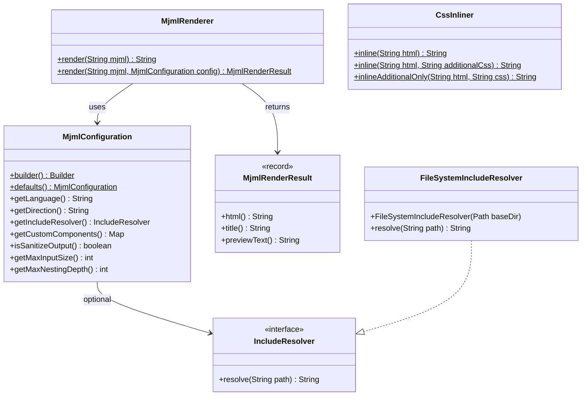
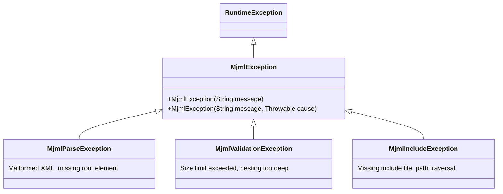

# API Reference

mjml-java exports six packages through its Java module `dev.jcputney.mjml`. This section documents the public API surface you interact with directly.

## Module Exports

| Package | Description |
|---------|-------------|
| `dev.jcputney.mjml` | Core API: renderer, configuration, exceptions, include resolver |
| `dev.jcputney.mjml.css` | Standalone CSS inlining engine |
| `dev.jcputney.mjml.component` | Component base classes and factory interface for custom components |
| `dev.jcputney.mjml.context` | Global and render context (advanced/internal use) |
| `dev.jcputney.mjml.parser` | MJML parser and AST node types (advanced/internal use) |
| `dev.jcputney.mjml.util` | Utility classes (CSS parsing, social networks, HTML escaping) |

For most use cases, you only need the `dev.jcputney.mjml` package.

## Class Diagram



## Exception Hierarchy

All exceptions are unchecked (extend `RuntimeException`), so you are not forced to catch them. Use targeted catch blocks when you need to distinguish between error types.



| Exception | Thrown When |
|-----------|------------|
| `MjmlParseException` | Malformed XML, missing `<mjml>` root element, invalid structure |
| `MjmlValidationException` | Input exceeds `maxInputSize`, nesting exceeds `maxNestingDepth` |
| `MjmlIncludeException` | Include file not found, path traversal attempt, circular includes |
| `MjmlException` | Base type -- catch this to handle all MJML errors |

```java
try {
    String html = MjmlRenderer.render(userInput);
} catch (MjmlParseException e) {
    // Invalid MJML structure
} catch (MjmlValidationException e) {
    // Input too large or too deeply nested
} catch (MjmlIncludeException e) {
    // Include resolution failed
} catch (MjmlException e) {
    // Catch-all for any MJML error
}
```
