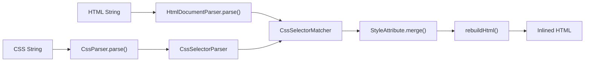
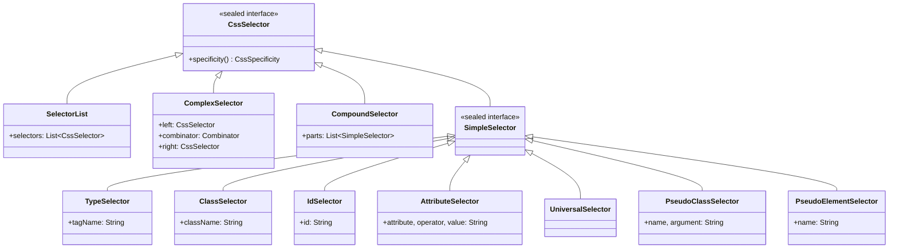

# CSS Inlining Engine

mjml-java includes a standalone CSS inlining engine that matches CSS rules to HTML elements and merges styles into inline `style` attributes. This page covers its design, the custom HTML parser, selector matching, specificity handling, and the rebuild strategy.

## Why a Custom HTML Parser?

Email HTML frequently contains **MSO conditional comments** for Outlook compatibility:

```html
<!--[if mso | IE]>
<table><tr><td>
<![endif]-->
<div>content</div>
<!--[if mso | IE]>
</td></tr></table>
<![endif]-->
```

These constructs break standard XML and HTML parsers. The JDK's `javax.xml` parser rejects them as malformed. Full HTML5 parsers (like jsoup) are external dependencies.

mjml-java solves this with `HtmlDocumentParser`, a lightweight tokenizer purpose-built for the well-structured HTML that the MJML renderer produces. It skips comments (including MSO conditionals), DOCTYPE declarations, CDATA sections, and processing instructions, building a minimal element tree suitable for CSS selector matching.

## Architecture



The inlining process follows seven steps:

1. **Extract `<style>` blocks** from the HTML (for `inline()` mode)
2. **Parse CSS** into rules and preserved at-rules
3. **Parse HTML** into a position-tracking element tree
4. **Parse selectors** and separate inlineable rules from pseudo rules
5. **Match and apply** styles to all elements
6. **Rebuild HTML** with modified style attributes
7. **Re-insert preserved rules** as a `<style>` block

## Two Inlining Modes

### `CssInliner.inline(html)`

General-purpose CSS inliner. Extracts all `<style>` blocks from the HTML, parses their CSS, matches rules to elements, inlines the styles, and re-inserts any non-inlineable rules (pseudo-classes, `@media`, etc.) as a single `<style>` block.

### `CssInliner.inlineAdditionalOnly(html, css)`

Used by the MJML renderer for `<mj-style inline="inline">` content. Inlines only the provided CSS without extracting or modifying existing `<style>` blocks. This preserves the base CSS resets already present in the document head.

## HtmlDocumentParser

`HtmlDocumentParser` tokenizes HTML into an `HtmlElement` tree. It is not a full HTML5 parser -- it handles the predictable structure of MJML renderer output.

### Position Tracking

Each `HtmlElement` records four character offsets in the source string:

| Field | Description |
|---|---|
| `tagStart` | Position of the opening `<` |
| `tagEnd` | Position after the closing `>` |
| `styleAttrStart` | Start of the `style` attribute value (inside quotes) |
| `styleAttrEnd` | End of the `style` attribute value (inside quotes) |

These positions enable the rebuild step to make surgical, in-place modifications to the original HTML string rather than re-serializing the entire document.

### Parsing Behavior

- **Comments and MSO conditionals** (`<!--...-->`) are skipped entirely
- **DOCTYPE declarations** are skipped
- **CDATA sections** are skipped
- **Void elements** (`br`, `img`, `hr`, `input`, etc.) are never pushed onto the stack
- **Raw text elements** (`style`, `script`) have their content skipped to avoid parsing HTML-like content inside them
- **Tag end detection** respects quoted attribute values to handle `>` inside attributes
- **Tolerant closing tags** pop the stack until a matching open tag is found (implicit close)

## CSS Selector System

The selector system is built as a sealed interface hierarchy:



### Supported Selectors

| Selector Type | Example | Specificity |
|---|---|---|
| Universal | `*` | (0, 0, 0) |
| Type | `div` | (0, 0, 1) |
| Class | `.red` | (0, 1, 0) |
| ID | `#main` | (1, 0, 0) |
| Attribute | `[href]`, `[type="text"]` | (0, 1, 0) |
| Pseudo-class | `:hover`, `:first-child` | (0, 1, 0) |
| Pseudo-element | `::before` | (0, 0, 1) |

### Supported Combinators

| Combinator | Syntax | Meaning |
|---|---|---|
| Descendant | `A B` | B is a descendant of A |
| Child | `A > B` | B is a direct child of A |
| Adjacent sibling | `A + B` | B immediately follows A |
| General sibling | `A ~ B` | B follows A (not necessarily immediately) |

### Attribute Selector Operators

| Operator | Meaning |
|---|---|
| `[attr]` | Has the attribute |
| `[attr=val]` | Exact match |
| `[attr~=val]` | Word match (whitespace-separated) |
| `[attr\|=val]` | Prefix-dash match |
| `[attr^=val]` | Starts with |
| `[attr$=val]` | Ends with |
| `[attr*=val]` | Contains |

## Specificity Calculation

Specificity is modeled as a `CssSpecificity(a, b, c)` record implementing `Comparable`:

- **a** = number of ID selectors
- **b** = number of class, attribute, and pseudo-class selectors
- **c** = number of type and pseudo-element selectors

Compound selectors sum specificity across their parts. Complex selectors (with combinators) sum the specificity of both sides. Selector lists use the maximum specificity of their individual selectors for matching purposes.

Inline `style` attributes have a virtual specificity of `(1, 0, 0, 0)` that always takes precedence. The inliner handles this by treating existing inline styles as highest priority during the merge step.

## Style Merging

When a CSS rule matches an element, its declarations are merged with the element's existing inline style. The merge follows these rules:

1. **Sort matched rules** by specificity (ascending), then by source order
2. **Parse existing inline style** into a declaration list
3. **Merge each matched rule's declarations** into the existing style:
   - Lower-specificity rules are applied first
   - Higher-specificity rules override lower ones
   - `!important` declarations override non-important ones regardless of specificity
   - Existing inline styles take precedence over CSS rules of equal specificity

## Rebuild Strategy

The rebuild phase applies style changes to the original HTML string using the position information recorded during parsing. Changes are collected into a `TreeMap` keyed by position, then applied in **reverse document order** (descending position) to avoid offset shifts.

Two cases are handled:

1. **Element has an existing `style` attribute**: Replace the value between `styleAttrStart` and `styleAttrEnd`
2. **Element has no `style` attribute**: Insert ` style="..."` before the closing `>` of the opening tag

This position-based approach preserves the original HTML formatting, whitespace, comments, and MSO conditionals exactly as they were -- only `style` attribute values are modified.

## Preserved Rules

Not all CSS rules can be inlined. The following are preserved in a `<style>` block in the output:

- **Pseudo-class selectors** (`:hover`, `:focus`, `:active`, etc.) -- these depend on user interaction
- **Pseudo-element selectors** (`::before`, `::after`) -- these create virtual elements
- **`@media` queries** -- responsive styles that depend on viewport
- **`@font-face` rules** -- font declarations
- **`@keyframes` rules** -- animation definitions

The CSS parser separates these during the parse step. After inlining, preserved rules are re-inserted as a single `<style type="text/css">` block in the document `<head>`.
