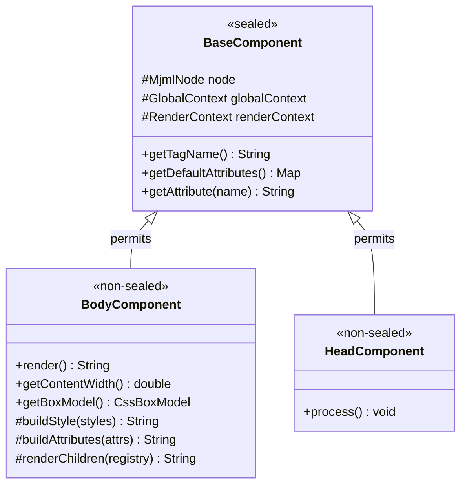
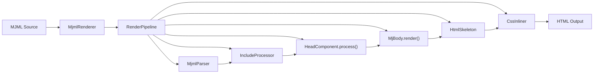

# Architecture Overview

mjml-java is a pure Java MJML-to-HTML renderer with **zero runtime dependencies** beyond the JDK itself. It targets Java 17+ and ships as a single JAR with full JPMS (Java Platform Module System) support.

## Design Principles

- **Zero dependencies** -- only `java.xml` and `java.logging` from the JDK
- **Sealed type hierarchy** -- `BaseComponent` is a sealed class, guaranteeing that every component is either a `BodyComponent` or a `HeadComponent`
- **Immutable configuration** -- `MjmlConfiguration` is built once and safely shared across threads
- **Functional factories** -- components are registered as `ComponentFactory` lambdas, enabling custom component injection without subclassing the registry
- **Thread safety** -- static `MjmlRenderer.render()` methods create isolated pipeline and context instances per call

## Module Declaration

```java
module dev.jcputney.mjml {
    requires java.xml;
    requires java.logging;

    exports dev.jcputney.mjml;
    exports dev.jcputney.mjml.component;
    exports dev.jcputney.mjml.context;
    exports dev.jcputney.mjml.parser;
}
```

## Package Structure

### `dev.jcputney.mjml` -- Public API

The top-level package contains the entry points and configuration:

| Class | Role |
|---|---|
| `MjmlRenderer` | Static `render()` methods -- the main entry point |
| `MjmlConfiguration` | Immutable builder-pattern config (language, direction, includes, custom components, sanitization limits) |
| `MjmlRenderResult` | Holds rendered HTML, document title, and preview text |
| `IncludeResolver` | Interface for resolving `mj-include` paths to MJML source |
| `FileSystemIncludeResolver` | File-system implementation of `IncludeResolver` |
| `MjmlException` | Base exception for rendering failures |
| `MjmlParseException` | Thrown on malformed MJML input |
| `MjmlValidationException` | Thrown on constraint violations (input size, nesting depth) |
| `MjmlIncludeException` | Thrown when include resolution fails |

### `dev.jcputney.mjml.component` -- Component Hierarchy



| Class | Role |
|---|---|
| `BaseComponent` | Abstract sealed base -- attribute resolution via 5-level cascade |
| `BodyComponent` | Abstract base for components that produce HTML via `render()` |
| `HeadComponent` | Abstract base for components that update `GlobalContext` via `process()` |
| `ComponentRegistry` | Maps tag names to `ComponentFactory` instances; freezable after initialization |
| `ComponentFactory` | `@FunctionalInterface` -- `create(MjmlNode, GlobalContext, RenderContext)` |

### `dev.jcputney.mjml.context` -- Rendering Context

| Class | Role |
|---|---|
| `GlobalContext` | Document-wide state: fonts, styles, attributes, title, preview text, breakpoint, media queries, html-attributes |
| `RenderContext` | Per-component state: container width, position among siblings (index, first, last) |
| `AttributeResolver` | Stateless utility implementing the 5-level attribute cascade |

### `dev.jcputney.mjml.parser` -- MJML Parsing

| Class | Role |
|---|---|
| `MjmlParser` | Preprocesses then parses MJML source into an `MjmlDocument` |
| `MjmlPreprocessor` | Wraps content tag bodies in CDATA for XML-safe parsing |
| `MjmlDocument` | Container for the parsed head and body `MjmlNode` trees |
| `MjmlNode` | Lightweight node representing an MJML element (tag, attributes, children, text) |
| `IncludeProcessor` | Expands `mj-include` elements using the configured `IncludeResolver` |
| `EntityTable` | Maps HTML entity names to characters for preprocessing |

### `dev.jcputney.mjml.css` -- CSS Inlining Engine

| Class | Role |
|---|---|
| `CssInliner` | Matches CSS rules to HTML elements and merges styles into inline `style` attributes |
| `HtmlDocumentParser` | Lightweight position-tracking HTML parser (handles MSO conditionals) |
| `HtmlElement` | Minimal DOM element with parent/child/sibling navigation and position tracking |
| `CssParser` | Tokenizes CSS text into `CssRule` and preserved at-rules |
| `CssRule` | A selector string + list of `CssDeclaration` values |
| `CssSelector` | Sealed interface hierarchy for parsed CSS selectors |
| `CssSelectorParser` | Parses selector text into `CssSelector` AST |
| `CssSelectorMatcher` | Matches `CssSelector` against `HtmlElement` nodes |
| `CssSpecificity` | `(a, b, c)` tuple implementing CSS specificity comparison |
| `CssDeclaration` | A single `property: value` pair with optional `!important` flag |
| `StyleAttribute` | Parses, merges, and serializes inline `style` attribute strings |

### `dev.jcputney.mjml.render` -- Rendering Pipeline

| Class | Role |
|---|---|
| `RenderPipeline` | Orchestrates the 7-phase rendering pipeline |
| `HtmlSkeleton` | Assembles the complete HTML document (DOCTYPE, head, CSS resets, fonts, media queries, body) |
| `DefaultFontRegistry` | Maps standard web font names to their `<link>` import URLs |
| `FontScanner` | Scans the component tree to auto-register default fonts |
| `HtmlAttributeApplier` | Applies `mj-html-attributes` to the rendered body via CSS selector matching |

### `dev.jcputney.mjml.util` -- Utilities

| Class | Role |
|---|---|
| `CssBoxModel` | Parses padding/border shorthand into top/right/bottom/left values |
| `CssUnitParser` | Converts CSS units (px, %, em) to pixel values |
| `HtmlEscaper` | Escapes attribute values and text content for safe HTML output |
| `SocialNetworkRegistry` | Maps social network names to icon URLs and link templates |

## Component Categories

The renderer supports all 33 standard MJML v4 components:

**Head components** (8): `mj-head`, `mj-title`, `mj-preview`, `mj-font`, `mj-breakpoint`, `mj-style`, `mj-attributes`, `mj-html-attributes`

**Layout components** (5): `mj-body`, `mj-section`, `mj-column`, `mj-group`, `mj-wrapper`

**Content components** (7): `mj-text`, `mj-image`, `mj-button`, `mj-divider`, `mj-spacer`, `mj-table`, `mj-raw`

**Interactive components** (13): `mj-hero`, `mj-accordion`, `mj-accordion-element`, `mj-accordion-title`, `mj-accordion-text`, `mj-carousel`, `mj-carousel-image`, `mj-navbar`, `mj-navbar-link`, `mj-social`, `mj-social-element`

## Data Flow



See [Rendering Pipeline](./pipeline.md) for a detailed walkthrough of each phase, and [CSS Inlining Engine](./css-engine.md) for the CSS processing internals.
