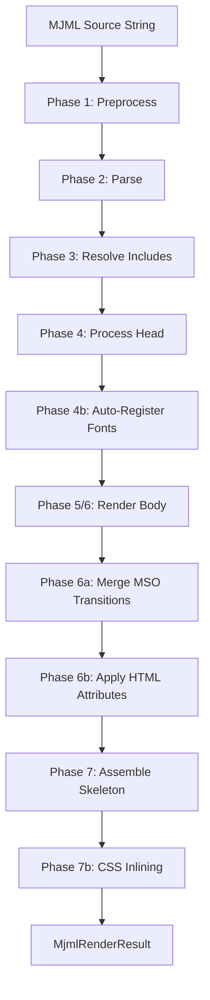
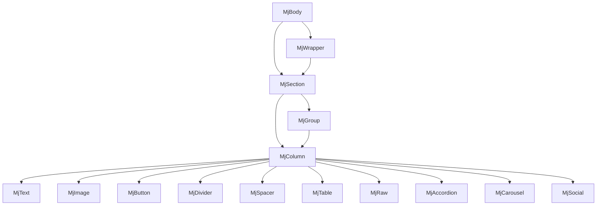

# Rendering Pipeline

The `RenderPipeline` class orchestrates the conversion of MJML source to a complete HTML email document through seven phases. Each phase is a distinct step with clear inputs and outputs.



## Phase 1: Preprocess

**Class:** `MjmlPreprocessor`

MJML templates contain HTML content inside tags like `<mj-text>`, `<mj-button>`, and `<mj-table>`. This raw HTML would break the XML parser, so the preprocessor wraps it in CDATA sections before parsing.

```xml
<!-- Input -->
<mj-text>Hello <b>World</b></mj-text>

<!-- After preprocessing -->
<mj-text><![CDATA[Hello <b>World</b>]]></mj-text>
```

The preprocessor identifies content tags (tags whose children are raw HTML rather than MJML components) and wraps only their inner content. Self-closing tags inside `<mj-attributes>` are left untouched.

## Phase 2: Parse

**Class:** `MjmlParser`

The preprocessed MJML is parsed as XML using the JDK's built-in `javax.xml.parsers.DocumentBuilder`. The resulting DOM is converted into a lightweight `MjmlDocument` containing two `MjmlNode` trees -- one for `<mj-head>` and one for `<mj-body>`.

`MjmlNode` is a simple data class holding:
- Tag name
- Attributes map
- Children list
- Text/CDATA content

The parser validates nesting depth against `MjmlConfiguration.getMaxNestingDepth()` to prevent stack overflow from deeply nested or malicious input.

## Phase 3: Resolve Includes

**Class:** `IncludeProcessor`

If an `IncludeResolver` is configured, this phase walks the document tree looking for `<mj-include>` elements. Each include is resolved by:

1. Reading the `path` attribute
2. Calling `IncludeResolver.resolve(path, context)` to load the include content
3. Parsing the included source
4. Replacing the `<mj-include>` node with the parsed content

Supported include types are `mjml` (default), `html`, `css`, and `css-inline`.
Include resolution enforces `maxIncludeDepth` from `MjmlConfiguration` to prevent excessive nesting.

The built-in `FileSystemIncludeResolver` resolves paths relative to a configurable base directory with path traversal protection.

## Phase 4: Process Head

**Classes:** `HeadComponent` subclasses, `GlobalContext`

The pipeline iterates over children of the `<mj-head>` node, instantiating each as a `HeadComponent` via the `ComponentRegistry`, then calling `process()`. Each head component extracts metadata into the `GlobalContext`:

| Component | Effect on GlobalContext |
|---|---|
| `mj-title` | Sets document title |
| `mj-preview` | Sets preview text |
| `mj-font` | Registers web font import URL |
| `mj-breakpoint` | Sets responsive breakpoint width |
| `mj-style` | Adds CSS (normal or `inline="inline"`) |
| `mj-attributes` | Registers tag defaults, `mj-all` defaults, and `mj-class` attributes |
| `mj-html-attributes` | Registers CSS-selector-based attribute overrides |

### Phase 4b: Auto-Register Default Fonts

**Class:** `FontScanner`

After head processing, the `FontScanner` recursively walks the parsed document tree, collecting `font-family` values from inline attributes. Any font matching a known web font in `DefaultFontRegistry` (e.g., "Open Sans", "Roboto") is automatically registered in `GlobalContext` so its `<link>` tag appears in the output, even without an explicit `<mj-font>` declaration.

## Phase 5: Attribute Resolution

**Class:** `AttributeResolver`

Attribute resolution is not a separate pass -- it happens lazily during rendering. When a component calls `getAttribute(name)`, the `AttributeResolver` evaluates a 5-level cascade:

```
Level 1: Inline attribute (on the element itself)
       |
       v
Level 2: mj-class attributes (from <mj-attributes>)
       |
       v
Level 3: Tag-specific defaults (e.g., <mj-section> defaults)
       |
       v
Level 4: mj-all defaults
       |
       v
Level 5: Component hardcoded defaults (getDefaultAttributes())
```

The first non-null value wins. This mirrors the MJML v4 cascade behavior.

## Phase 6: Render Body

**Classes:** `MjBody`, `BodyComponent` subclasses

Rendering is a top-down tree traversal. `MjBody.render()` iterates over its children (sections, wrappers), each of which renders its own children (columns, groups), and so on down to leaf content components.

Each `BodyComponent` subclass implements `render()` to produce its HTML fragment:



Container components (`MjBody`, `MjSection`, `MjColumn`, `MjGroup`, `MjWrapper`) hold a reference to the `ComponentRegistry` and use `renderChildren(registry)` to instantiate and render child components.

Content components (`MjText`, `MjImage`, `MjButton`, etc.) are leaf nodes that produce self-contained HTML.

Key rendering details:

- **Width propagation**: Container components compute their inner content width (accounting for padding and borders) and pass it down via `RenderContext`
- **Box model**: `CssBoxModel` parses CSS shorthand padding/border values into individual top/right/bottom/left values
- **MSO conditionals**: Layout components emit `<!--[if mso | IE]>` conditional blocks for Outlook compatibility, using VML for background images
- **Position tracking**: `RenderContext` carries each component's index among siblings, plus first/last flags, used for padding adjustments in columns and navbar links

### Phase 6a: Merge MSO Section Transitions

After body rendering, adjacent MSO conditional close/open patterns are merged. When two `mj-section` components are rendered back-to-back, the close of one MSO table and open of the next are combined into a single conditional block:

```html
<!-- Before merging -->
<!--[if mso | IE]></td></tr></table><![endif]-->
    <!--[if mso | IE]><table ...

<!-- After merging -->
<!--[if mso | IE]></td></tr></table><table ...
```

This matches the behavior of the official MJML renderer.

### Phase 6b: Apply HTML Attributes

**Class:** `HtmlAttributeApplier`

If the template included `<mj-html-attributes>`, this phase applies CSS-selector-based attribute insertions to the rendered body HTML. This allows adding custom attributes (like `data-*` or `id`) to specific elements in the output without modifying component rendering logic.

## Phase 7: Assemble Skeleton

**Class:** `HtmlSkeleton`

The skeleton assembler wraps the rendered body HTML in a complete HTML document structure:

1. **DOCTYPE and `<html>` tag** with language, direction, and XML namespace attributes
2. **`<head>` section** containing:
   - `<title>` from `mj-title`
   - `<!--[if !mso]>` meta tags for charset, viewport, and X-UA-Compatible
   - `<style>` block with CSS resets, responsive media queries, and Outlook-specific styles
   - Font `<link>` tags for registered web fonts
   - Custom `<mj-style>` content
   - Head comments from `mj-head`
3. **`<body>` section** wrapping the rendered body content with configurable width and background color
4. **File-start/file-end content** from `mj-raw` with `position` attributes

### Phase 7b: CSS Inlining

**Class:** `CssInliner`

If any `<mj-style inline="inline">` blocks were declared, their CSS is inlined into the HTML at this stage using `CssInliner.inlineAdditionalOnly()`. This method inlines only the provided CSS without extracting or removing existing `<style>` blocks from the head.

After inlining, two post-processing transformations are applied to match the output of the official MJML toolchain (which uses juice/cheerio for CSS inlining):

1. Empty `style=""` attributes are collapsed to `style` (no quotes)
2. Self-closing tag slashes are removed (`/>` becomes `>`)

## Pipeline Initialization

The `RenderPipeline` constructor obtains a frozen `ComponentRegistry` from a bounded, synchronized cache keyed by configuration identity. If no cached entry exists, it creates one by registering all 31 built-in top-level renderable components plus any custom components from the configuration, then freezes it to prevent modification during rendering.

```java
MjmlRenderer.render(mjml)
  -> new RenderPipeline(config)
       -> createRegistry()      // register all components
       -> registry.freeze()     // lock the registry
  -> pipeline.render(mjml)      // execute the 7 phases
  -> MjmlRenderResult           // html + title + preview
```
